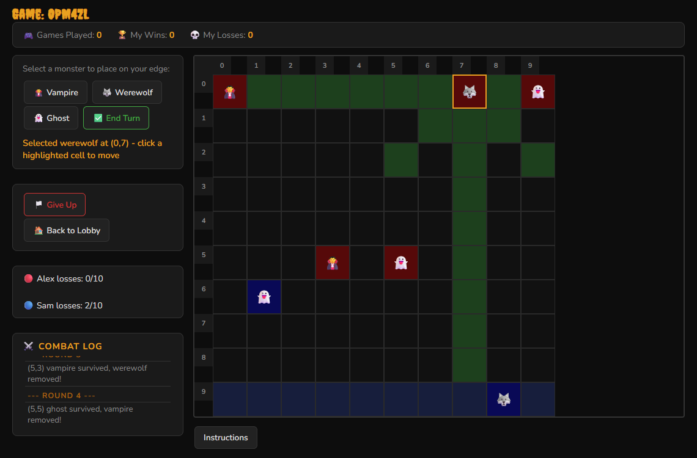
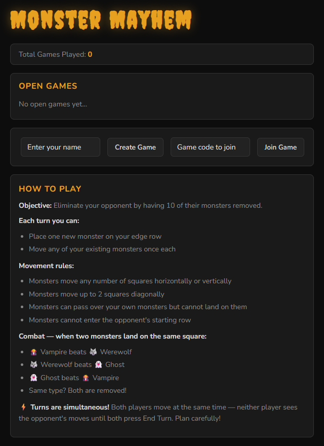

# 🧛 Monster Mayhem

A real-time, two-player browser strategy game where vampires, werewolves and ghosts battle on a 10×10 board. Built individually with Node.js, Express and Socket.io for the **Concurrent Systems** module (Year 3, CCT College Dublin). The focus of the project is handling simultaneous player actions safely on a shared server.



## Features

- **Live lobby:** see open games and how many players are online; create a game and share its 6-character code (with a copy button), or join from the list
- **Simultaneous turns:** both players place and move monsters at the same time; neither sees the other's moves until both click **End Turn**
- **Rock-paper-scissors combat:** 🧛 Vampire beats 🐺 Werewolf, 🐺 Werewolf beats 👻 Ghost, 👻 Ghost beats 🧛 Vampire; same type removes both
- **Movement rules:** place one monster per turn on your edge row, move over your own monsters but not onto them, with valid moves highlighted
- **Win condition:** the first player to lose 10 monsters is eliminated, with ties handled
- **Round-by-round combat log**, board coordinates and in-game instructions
- **Win/loss stats** per player name and a global games-played counter
- **Give up**, **back to lobby** and **disconnect handling**: if a player leaves mid-game, the opponent is awarded the win
- **Multiple games at once**, each fully isolated from the others
- Dark horror-themed UI

## How the concurrency works

- **Barrier pattern:** the server collects `endTurn` events per game and only resolves the round once *every* player has submitted. Duplicate `endTurn` events from the same player are ignored.
- **Server-authoritative state:** the server keeps the real board. When both players land on the same square, the second piece is stored as a *challenger* and the fight is resolved on the server after the barrier fires. The resolved board is then broadcast to both clients, so their views never drift apart.
- **Isolated game rooms:** each game is its own object in a `games` map and its own Socket.io room, so events from one game never reach another.

## Tech

| Part | Technology |
|---|---|
| Server | Node.js, Express 5, Socket.io 4 |
| Client | HTML, CSS, vanilla JavaScript, Socket.io client |

```
monster-mayhem/
├── server/server.js   Express + Socket.io server: lobby, game rooms, turn barrier, combat
└── client/
    ├── index.html     Single-page UI (lobby + game view)
    ├── game.js        Board rendering, move validation, socket events
    └── style.css      Dark horror theme (Creepster font)
```

## How to run

**You need:** Node.js 18+.

```bash
cd monster-mayhem
npm install
npm start
```

Open http://localhost:3000 in two browser tabs to play against yourself. To play on another device on the same network, open `http://<your-computer's-IP>:3000`.

> This game needs its Node.js server running, so it can't be hosted on GitHub Pages.



## Notes and known limitations

- Player names are inserted into the page without HTML escaping, so a crafted name could inject script into other players' lobby (cross-site scripting). Names should be escaped before rendering.
- Move validation happens in the browser; the server applies moves without re-checking them or checking which player sent them, so a modified client could cheat.
- Stats and games are kept in memory, so they reset when the server restarts, and finished games aren't cleaned up.
- There are no automated tests.
- AI assistance was permitted for this assignment; the commits where it was used (lobby, board and placement) are marked `[AI assisted]` in the history.

## Credits

- Fonts: Creepster and Nunito from Google Fonts
